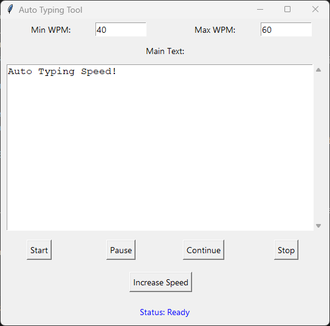

# Auto Typing Tool

Welcome to the **Auto Typing Tool**, an advanced, fast, and optimized solution for automated typing tasks, built with Python! This tool is designed to save time and effort, offering unmatched speed and precision. Whether you need a bot for text simulation or just an auto typer to handle repetitive tasks, this is the fastest and best choice.



## Features

### 🚀 Speed and Performance
- Adjustable typing speed with **Min WPM** and **Max WPM**.
- Smooth, natural typing simulation using the `pynput` library.
- **Optimized typing delays** for realistic performance.
- Speed adjustment: Increase typing speed dynamically by **1.5x**.

### 💻 User-Friendly Interface
- Built with **Tkinter**, providing a clean and interactive GUI.
- Editable input fields for custom text and speed control.
- Real-time status updates for better usability.

### 🔄 Typing Controls
- **Start**: Begin typing with your configured speed.
- **Pause**: Temporarily halt the typing process.
- **Continue**: Resume typing seamlessly.
- **Stop**: Stop and reset the progress at any time.

### 🧠 Intelligent Design
- Handles large text inputs effortlessly.
- Dynamically calculates delay per character for optimized performance.
- Safe and robust threading to ensure smooth operation.

## Getting Started

Follow these steps to set up and run the Auto Typing Tool on your system.

### Prerequisites
Make sure you have the following installed:
- **Python 3.6+**
- Required libraries:
  - `tkinter`
  - `pynput`

You can install the `pynput` library using pip:
```bash
pip install pynput
```

### Installation
1. Clone the repository or download the script.
2. Save the file as `auto_typing_tool.py`.
3. Open a terminal and navigate to the script’s directory.

### Running the Application
To start the Auto Typing Tool:
```bash
python auto_typing_tool.py
```
This will launch the graphical interface where you can configure typing parameters and start auto typing.

## How to Use

1. **Set Typing Speed**:
   - Enter desired values for **Min WPM** and **Max WPM** in the input fields.
2. **Input Text**:
   - Paste or type your target text in the **Main Text** field.
3. **Start Typing**:
   - Click the **Start** button to begin the auto typing process.
4. **Control Typing**:
   - Use the **Pause**, **Continue**, and **Stop** buttons to control the operation.
5. **Boost Speed**:
   - Click the **Increase Speed** button to raise the typing speed by 1.5x instantly.

## System Functionalities

| Functionality         | Description                                                                 |
|-----------------------|-----------------------------------------------------------------------------|
| **Start Typing**      | Begins typing the text at the configured speed.                            |
| **Pause Typing**      | Pauses the typing process temporarily.                                     |
| **Continue Typing**   | Resumes typing from where it was paused.                                   |
| **Stop Typing**       | Stops the typing process and resets progress.                              |
| **Increase Speed**    | Dynamically increases typing speed by 1.5x, updating WPM values.           |
| **GUI Interaction**   | Intuitive interface for configuring and controlling the auto typing bot.   |

## Technical Details

- **Language**: Python
- **Frameworks**: Tkinter for GUI, Pynput for keyboard simulation.
- **Threading**: Ensures seamless typing without freezing the interface.
- **Randomized Delays**: Adds realism by introducing slight variations in typing speed.

## Why Choose This Auto Typing Tool?

- **Fastest Auto Typer**: Configurable speeds ensure you’re always ahead.
- **Best Python Typing Bot**: Built with clean, modular code.
- **SEO-Optimized**: Perfect for text simulation, writing bots, and automation tasks.
- **Lightweight and Efficient**: Requires minimal resources to operate.

## Contribution

We welcome contributions to improve this Auto Typing Tool! Feel free to fork the repository, create new features, or optimize the existing ones.

## License
This project is licensed under the MIT License. You’re free to use, modify, and distribute this tool as long as proper credit is given.

---

Download, run, and experience the fastest and best **Auto Typing Bot** built with Python today!

